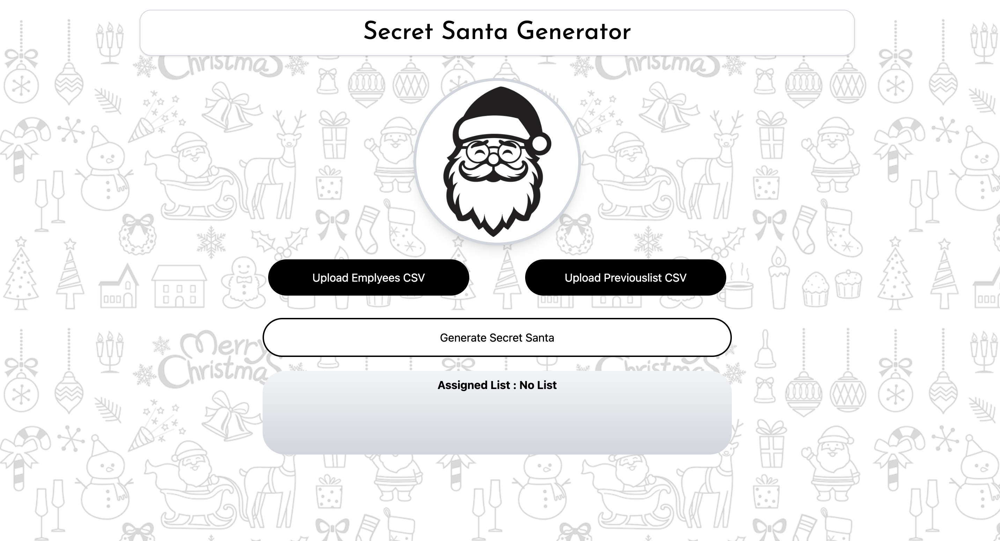
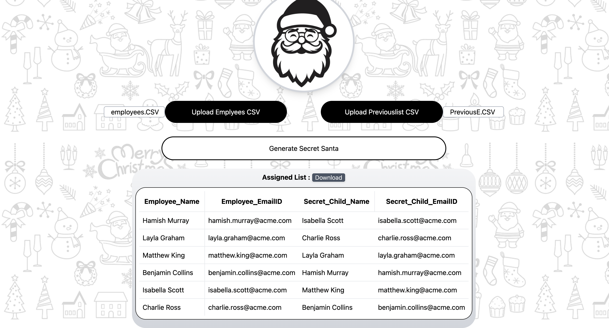

# 🎅 Secret Santa Generator

Secret Santa Generator is a web application that allows users to upload employee lists and previous year assignments to generate unique and fair Secret Santa pairings. It ensures that no one is assigned to themselves and avoids assigning the same pairs from previous years.

### Home Page


## 🚀 Features

- 📂 **CSV File Upload**: Upload employee lists and previous year pairings.
- 🔄 **Unique Pairing Algorithm**: Ensures fair and random Secret Santa assignments.
- 📥 **Download Assignments**: Export the generated assignments as a CSV file.
- 🎨 **Festive UI**: A visually appealing interface with a holiday theme.
- ✅ **Error Handling**: Proper validation for file uploads and assignment generation.

### Generated Assignments


## 🛠️ Installation & Setup

1. **Clone the repository:**
   ```sh
   git clone https://github.com/yourusername/secret-santa-generator.git
   cd secret-santa-generator
   ```
2. **Install dependencies:**
   ```sh
   npm install
   ```
3. **Start the development server:**
   ```sh
   npm run dev
   ```

## 📂 File Structure
```
secret-santa-generator/
│── public/
│── src/
│   ├── components/
│   │   ├── FileUpload.js
│   │   ├── SantaAssignments.js
│   │   ├── DownloadCSV.js
│   ├── utils/
│   │   ├── assignmentLogic.js
│   ├── App.js
│   ├── index.js
│── package.json
│── README.md
```

## ⚡ Usage Guide
1. **Upload Employees CSV**: Click on the upload button and select your CSV file containing employee names.
2. **Upload Previous Assignments (Optional)**: If you want to avoid previous year pairings, upload the corresponding CSV.
3. **Generate Assignments**: Click the 'Generate Secret Santa' button to get the assignments.
4. **Download CSV**: Once the assignments are generated, download them as a CSV file.


